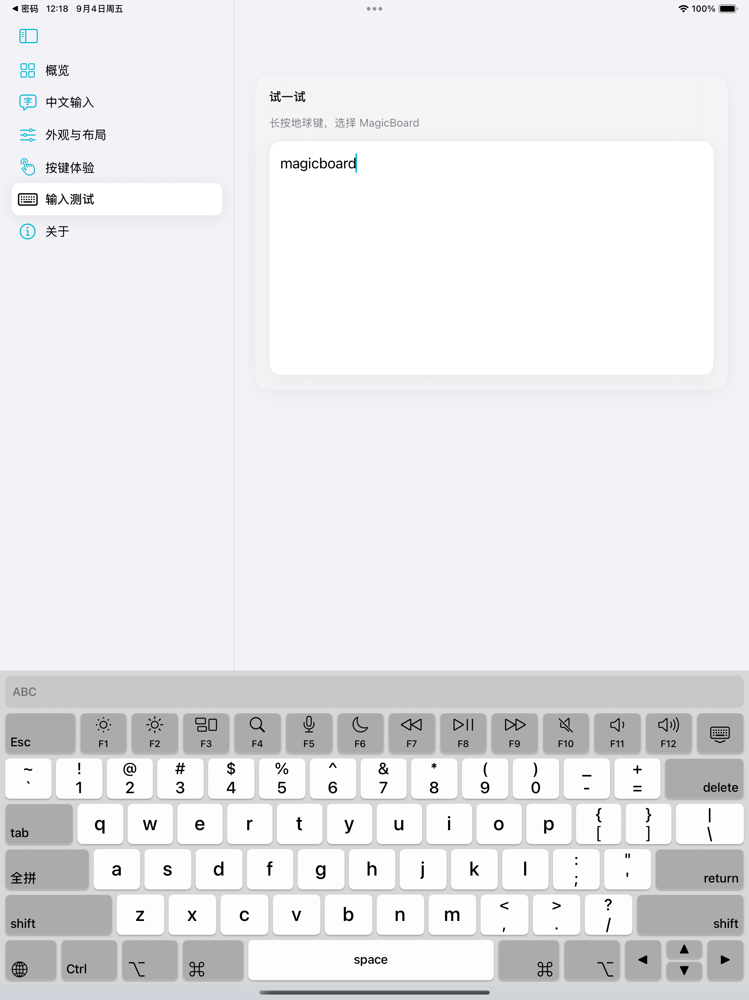

<div align="center">


# MagicBoard

A full-size, Mac-style keyboard for TrollStore iPads with ordinary text input, offline Chinese input, and hardware-keyboard-grade shortcuts.

[简体中文](README.md) · [Download](../../releases/latest)

</div>



MagicBoard is an iPadOS Keyboard Extension. It combines a six-row Mac-style layout, offline Rime Chinese input, and HID-dispatched Esc, Tab, F1–F12, Ctrl, Option, Command, and arrow keys. Its companion app controls enablement checks, Chinese schemes, appearance, layout, feedback, and modifier behavior.

> [!IMPORTANT]
> MagicBoard depends on TrollStore and a private HID entitlement. It is not intended for App Store distribution, ordinary sideload signing, or devices without TrollStore. The minimum supported version is iPadOS 16.0.

## Quick Start

Give your coding agent this repository URL and ask:

```text
Install this repository and install the latest MagicBoard.tipa on my connected TrollStore iPad.
```

## Traditional Start

1. Download `MagicBoard.tipa` from [Releases](../../releases/latest).
2. Install it on the iPad with TrollStore.
3. Open MagicBoard and follow the shortcut to Settings > General > Keyboard > Keyboards.
4. Add MagicBoard and allow full access.
5. Open a normal text field and switch to MagicBoard with the globe key.

> [!NOTE]
> Password fields and apps that explicitly reject third-party keyboards fall back to the system keyboard. This is expected iPadOS security behavior.

## Features

- Six-row Mac-style layout with portrait/landscape support, light/dark appearance, and configurable sizing, spacing, and colors.
- Normal text, Shift/Caps Lock, repeating Delete, alternate-character drag, and trackpad-style cursor movement.
- HID behavior for Esc, Tab, F1–F12, Ctrl, Option, Command, and all four arrow keys.
- Hold, toggle, and mixed modifier modes with centralized release on keyboard dismissal, host backgrounding, or extension restart.
- Offline Rime full Pinyin and six double-Pinyin schemes, candidate bar, and supplemental system lexicon candidates.
- Configurable key sounds, speaker-based tactile simulation, accent color, and keyboard appearance.
- Optional remote companion mode that forwards special keys, modifiers, or the complete keyboard to a macOS or Windows host.

## Remote Companion

When remote-desktop software does not carry every HID key produced by an iPad third-party keyboard, run the MagicBoard companion on the controlled computer. The keyboard sends standard HID usages over local UDP; the companion injects them through native macOS events or Windows `SendInput`.

Download the single-file program for the controlled computer from the latest [GitHub Release](../../releases/latest):

- macOS (Apple Silicon): [`cpmac`](https://github.com/yourpapayouknow/MagicBoard/releases/latest/download/cpmac)
- Windows 11 x64: [`cpwin.exe`](https://github.com/yourpapayouknow/MagicBoard/releases/latest/download/cpwin.exe)

On first launch on macOS, allow the current terminal or `cpmac` under System Settings > Privacy & Security > Accessibility:

```zsh
chmod +x ./cpmac
./cpmac --port 52088
```

On Windows, PowerShell 7 is recommended. If the current window is not elevated, `--elevate` requests administrator access through UAC:

```powershell
.\cpwin.exe --elevate --port 52088
```

In the MagicBoard host app on iPad, open Remote Companion, choose the target OS, enter the controlled computer's LAN address, `.local` name, or Tailscale IP, keep the same port, and tap Ping. After it connects, use the route capsule on the keyboard candidate bar to cycle Local → Remote Keys → Remote Full. Every new keyboard session starts in Local mode.

> [!WARNING]
> MBCP v1 uses unauthenticated, unencrypted UDP packets. Use it only on a trusted LAN or private Tailscale network. Never expose port 52088 directly to the public Internet. If Windows Ping fails, allow inbound UDP 52088 only on the current trusted network.

## Build from Source

You need macOS, Xcode 16, XcodeGen, `ldid`, a Swift 6 toolchain, and the system `zip`, `unzip`, and `plutil` tools. Network access is required to resolve dependencies.

```zsh
git clone <repository-url>
cd magicboard
./scripts/build-tipa.zsh
```

The script generates the Xcode project, performs a generic iOS Release build, applies separate entitlements to the host app and keyboard extension, validates bundle IDs, versions, full access, HID permission, and ZIP structure, then writes:

```text
build/MagicBoard.tipa
```

## Verification

```zsh
swift test --package-path Packages/MagicBoardShared
npx @google/design.md lint DESIGN.md
./scripts/build-tipa.zsh
```

Before a final release, repeat native third-party app, terminal/code editor, restricted-field, and physical touch-combination tests on the target TrollStore iPad. CoreSimulator cannot prove private HID or jetsam behavior on real hardware.

## Project Structure

| Path | Purpose |
| --- | --- |
| `App/` | SwiftUI settings host app |
| `Keyboard/` | UIKit Keyboard Extension, HID bridge, Rime engine, and resources |
| `Packages/MagicBoardShared/` | Shared configuration, input state, and tests |
| `Companion/` | macOS and Windows remote-companion sources, builds, and acceptance tools |
| `project.yml` | XcodeGen targets, versions, dependencies, and entitlements |
| `scripts/build-tipa.zsh` | One-command Release build and TrollStore `.tipa` packaging |
| `DESIGN.md` | UI design system and component constraints |

## Technical Notes

- Host app: SwiftUI
- Keyboard extension: UIKit + Objective-C HID bridge
- Chinese engine: LibrimeKit / Rime with resources bundled locally
- Configuration sync: App Group `group.com.iwmei.magicboard`
- Remote protocol: MBCP v1 over UDP 52088 with standard USB HID usages
- Distribution artifact: arm64, iPad-only TrollStore `.tipa`
